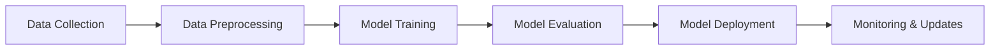

# 🧠 AI & Machine Learning Basics

## 🎯 Learning Objectives
By the end of this section, you will:
- Understand what AI, ML, and Generative AI are
- Know the different types of machine learning
- Recognize real-world applications
- Be ready to dive deeper into technical concepts

## 📚 What is Artificial Intelligence?

**Artificial Intelligence (AI)** is the simulation of human intelligence in machines that are programmed to think and learn like humans.

### Key Formula
```
Data + Algorithms = AI Machines
```

## 🔍 Types of AI

### 1. Narrow AI (Weak AI)
- Designed for specific tasks
- Examples: Siri, Netflix recommendations, spam filters

### 2. General AI (Strong AI)
- Human-level intelligence across all domains
- Currently theoretical

### 3. Superintelligence
- Exceeds human intelligence
- Future possibility

## 🤖 Machine Learning (ML)

**Definition by Tom Mitchell:**
> "A computer program is said to learn from experience E with respect to some class of tasks T and performance measure P if its performance at tasks in T, as measured by P, improves with experience E."

### Types of Machine Learning

#### 1. 📊 Supervised Learning
- **Definition**: Learning with labeled data
- **Goal**: Predict outcomes for new data
- **Examples**: 
  - Email spam detection
  - Image classification
  - Price prediction

```python
# Example: Predicting house prices
# Input: [size, bedrooms, location] → Output: price
X = [[1500, 3, 1], [2000, 4, 2]]  # Features
y = [300000, 450000]              # Labels (prices)
```

#### 2. 🔍 Unsupervised Learning
- **Definition**: Finding patterns in unlabeled data
- **Goal**: Discover hidden structures
- **Examples**:
  - Customer segmentation
  - Anomaly detection
  - Data compression

```python
# Example: Customer segmentation
# Input: [age, income, spending] → Output: customer groups
X = [[25, 50000, 2000], [45, 80000, 5000]]  # No labels!
```

#### 3. 🎮 Reinforcement Learning
- **Definition**: Learning through interaction and rewards
- **Goal**: Maximize cumulative reward
- **Examples**:
  - Game playing (AlphaGo)
  - Autonomous vehicles
  - Trading algorithms

## 🎨 What is Generative AI?

**Generative AI** is a subset of AI that creates new content:
- 📝 **Text**: ChatGPT, GPT-4
- 🖼️ **Images**: DALL-E, Midjourney
- 🎵 **Audio**: Music generation
- 🎬 **Video**: AI-generated videos

### Key Difference
- **Traditional AI**: Recognizes and classifies
- **Generative AI**: Creates and generates

## 🌍 Real-World Applications

| Domain | Traditional AI | Generative AI |
|--------|---------------|---------------|
| **Healthcare** | Disease diagnosis | Drug discovery, medical reports |
| **Finance** | Fraud detection | Financial report generation |
| **Entertainment** | Recommendation systems | Content creation, game design |
| **Education** | Adaptive learning | Personalized tutoring, content |
| **Transportation** | Route optimization | Autonomous driving scenarios |

## 🔧 Common AI Tasks

### Classification vs Regression

#### Classification
- **Output**: Categories/Classes
- **Examples**: 
  - Is this email spam? (Yes/No)
  - What animal is in this image? (Cat/Dog/Bird)

#### Regression
- **Output**: Continuous numbers
- **Examples**:
  - What will the temperature be tomorrow? (23.5°C)
  - How much will this house sell for? ($450,000)

## 📈 The AI Learning Pipeline



## 🧪 Hands-On Exercise

### Exercise 1: Identify the ML Type
For each scenario, identify if it's supervised, unsupervised, or reinforcement learning:

1. Predicting stock prices using historical data
2. Grouping customers by shopping behavior
3. Training a robot to play chess
4. Detecting fraudulent transactions
5. Finding topics in news articles

<details>
<summary>Click for answers</summary>

1. Supervised (regression)
2. Unsupervised (clustering)
3. Reinforcement learning
4. Supervised (classification)
5. Unsupervised (topic modeling)

</details>

## 🎯 Key Takeaways

- AI is about making machines intelligent
- ML is a subset of AI that learns from data
- Generative AI creates new content
- Different problems require different ML approaches
- Real-world applications are everywhere

## 📚 Next Steps

Ready to move on? Next, we'll learn:
- [Python for AI](../02-Python-for-AI/) - Essential programming skills
- [Mathematics for AI](../03-Math-for-AI/) - The math behind the magic

## 🔗 Additional Resources

- [Machine Learning Yearning by Andrew Ng](https://www.deeplearning.ai/machine-learning-yearning/)
- [Elements of AI Course](https://www.elementsofai.com/)
- [AI for Everyone by Andrew Ng](https://www.coursera.org/learn/ai-for-everyone)

---
*Continue to [Python for AI](../02-Python-for-AI/) →*