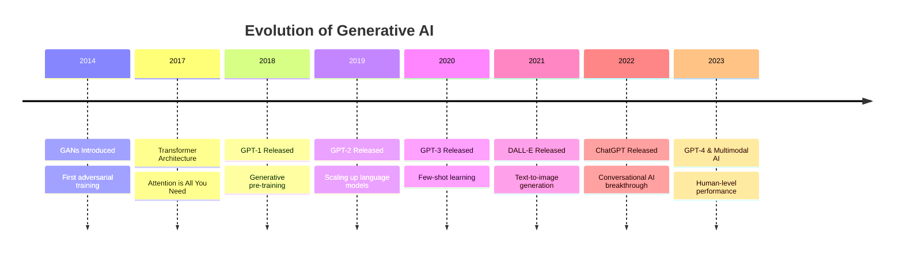

# 🎨 Introduction to Generative AI

## 🎯 Learning Objectives
By the end of this section, you will:
- Understand the core concepts of Generative AI
- Know the main architectures and their applications
- Differentiate between various generative models
- Be prepared to dive into specific implementations

## 🌟 What Makes Generative AI Special?

Traditional AI focuses on **understanding** and **classifying** existing data. Generative AI goes beyond this by **creating** entirely new content that didn't exist before.

### The Paradigm Shift
```
Traditional AI: Input → Analysis → Classification/Prediction
Generative AI: Input → Learning → Creation of New Content
```

## 🏗️ Core Generative AI Architectures

### 1. 🥊 Generative Adversarial Networks (GANs)
**Concept**: Two neural networks competing against each other

```python
# Simplified GAN concept
class GAN:
    def __init__(self):
        self.generator = Generator()      # Creates fake data
        self.discriminator = Discriminator()  # Detects fake vs real
    
    def train(self):
        # Generator tries to fool discriminator
        # Discriminator tries to catch generator
        # Both improve through competition
```

**Applications**:
- Image generation (faces, artwork)
- Style transfer
- Data augmentation
- Super-resolution

### 2. 🔄 Variational Autoencoders (VAEs)
**Concept**: Encode data into a latent space, then decode to generate new samples

```python
# VAE concept
class VAE:
    def __init__(self):
        self.encoder = Encoder()    # Data → Latent space
        self.decoder = Decoder()    # Latent space → New data
    
    def generate(self, latent_vector):
        return self.decoder(latent_vector)
```

**Applications**:
- Image generation with smooth interpolation
- Anomaly detection
- Data compression
- Drug discovery

### 3. 🔀 Transformers
**Concept**: Attention-based architecture that processes sequences

```python
# Transformer concept
class Transformer:
    def __init__(self):
        self.attention = MultiHeadAttention()
        self.feed_forward = FeedForward()
    
    def forward(self, sequence):
        # Self-attention: What parts of input are important?
        attended = self.attention(sequence)
        return self.feed_forward(attended)
```

**Applications**:
- Text generation (GPT models)
- Language translation
- Code generation
- Multimodal AI

### 4. 🌊 Diffusion Models
**Concept**: Learn to reverse a noise process

```python
# Diffusion concept
class DiffusionModel:
    def add_noise(self, image, timestep):
        # Gradually add noise to image
        return noisy_image
    
    def denoise(self, noisy_image, timestep):
        # Learn to remove noise step by step
        return cleaner_image
```

**Applications**:
- High-quality image generation (DALL-E 2, Stable Diffusion)
- Image editing and inpainting
- 3D model generation

## 🎭 Types of Generative Content

### 📝 Text Generation
- **Models**: GPT-3/4, Claude, LLaMA
- **Applications**: 
  - Creative writing
  - Code generation
  - Chatbots and assistants
  - Content creation

### 🖼️ Image Generation
- **Models**: DALL-E, Midjourney, Stable Diffusion
- **Applications**:
  - Art and design
  - Product visualization
  - Marketing materials
  - Game asset creation

### 🎵 Audio Generation
- **Models**: WaveNet, MusicLM, VALL-E
- **Applications**:
  - Music composition
  - Voice synthesis
  - Sound effects
  - Podcast generation

### 🎬 Video Generation
- **Models**: Runway ML, Synthesia, Make-A-Video
- **Applications**:
  - Video editing
  - Animation
  - Virtual presenters
  - Training simulations

## 🔍 Key Concepts in Generative AI

### 1. Latent Space
A compressed representation where similar items are close together.

```python
# Example: Word embeddings in latent space
# "king" - "man" + "woman" ≈ "queen"
king_vector - man_vector + woman_vector = queen_vector
```

### 2. Training Objectives

#### Maximum Likelihood Estimation (MLE)
```python
# Goal: Maximize probability of generating real data
loss = -log(P(real_data | model_parameters))
```

#### Adversarial Training
```python
# Generator loss: Fool the discriminator
generator_loss = -log(discriminator(generated_data))

# Discriminator loss: Distinguish real from fake
discriminator_loss = -log(discriminator(real_data)) - log(1 - discriminator(fake_data))
```

### 3. Evaluation Metrics

#### For Images:
- **FID (Fréchet Inception Distance)**: Measures quality and diversity
- **IS (Inception Score)**: Measures quality and diversity
- **LPIPS**: Perceptual similarity

#### For Text:
- **BLEU**: Translation quality
- **ROUGE**: Summarization quality
- **Perplexity**: Language model quality

## 🚀 The Evolution of Generative AI



## 🎯 Choosing the Right Architecture

| Use Case | Best Architecture | Why? |
|----------|------------------|------|
| **High-quality images** | Diffusion Models | Superior image quality |
| **Fast image generation** | GANs | Real-time generation |
| **Text generation** | Transformers | Excellent at sequences |
| **Controllable generation** | VAEs | Smooth latent space |
| **Few-shot learning** | Large Language Models | Pre-trained knowledge |

## 🧪 Hands-On Exercise

### Exercise 1: Architecture Matching
Match each application with the most suitable architecture:

1. Creating realistic human faces
2. Generating code from natural language
3. Creating variations of an existing image
4. Building a chatbot
5. Generating high-resolution artwork

**Architectures**: GANs, Transformers, VAEs, Diffusion Models

<details>
<summary>Click for answers</summary>

1. GANs (fast, realistic faces)
2. Transformers (code generation)
3. VAEs (smooth variations)
4. Transformers (language understanding)
5. Diffusion Models (high-quality art)

</details>

## 🔮 Current Trends & Future Directions

### 🔥 Hot Topics (2024)
- **Multimodal AI**: Models that understand text, images, and audio
- **AI Agents**: Autonomous systems that can take actions
- **Retrieval-Augmented Generation (RAG)**: Combining generation with knowledge retrieval
- **Small Language Models (SLMs)**: Efficient models for specific tasks
- **Constitutional AI**: Building safer, more aligned AI systems

### 🚀 Emerging Applications
- **Scientific Discovery**: Drug design, material science
- **Creative Industries**: Film, music, game development
- **Education**: Personalized tutoring, content creation
- **Healthcare**: Medical imaging, treatment planning
- **Software Development**: Code generation, debugging

## 🎯 Key Takeaways

- Generative AI creates new content rather than just analyzing existing data
- Different architectures excel at different types of generation
- The field is rapidly evolving with new breakthroughs regularly
- Applications span across industries and creative domains
- Understanding the fundamentals helps choose the right approach

## 📚 Next Steps

Ready to dive deeper? Choose your path:
- [GANs Deep Dive](../02-GANs/) - Learn adversarial training
- [Transformers](../04-Transformers/) - Master attention mechanisms
- [Diffusion Models](../06-Diffusion-Models/) - Explore state-of-the-art image generation

## 🔗 Essential Resources

- [Generative Deep Learning by David Foster](https://www.oreilly.com/library/view/generative-deep-learning/9781492041931/)
- [The Illustrated Transformer](https://jalammar.github.io/illustrated-transformer/)
- [Distill.pub - Visual Explanations](https://distill.pub/)
- [Papers With Code - Generative Models](https://paperswithcode.com/methods/category/generative-models)

---
*Continue to [GANs](../02-GANs/) or [Transformers](../04-Transformers/) →*