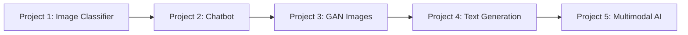

# 🛠️ Practical Projects

## 🎯 Project-Based Learning

Learn by building! These projects are designed to reinforce concepts from each learning level and provide hands-on experience with real-world applications.

## 📊 Project Difficulty Levels

| Level | Prerequisites | Time Investment | Skills Gained |
|-------|--------------|-----------------|---------------|
| 🌱 **Beginner** | Basic Python, ML concepts | 1-2 weeks | Foundation skills |
| 🌿 **Intermediate** | Neural networks, frameworks | 2-4 weeks | Practical implementation |
| 🌳 **Advanced** | Deep learning, architectures | 4-6 weeks | Advanced techniques |
| 🚀 **Expert** | Research knowledge | 6+ weeks | Cutting-edge applications |

## 🚀 Project Portfolio

### 🌱 Project 1: Image Classifier
**Level**: Beginner | **Time**: 1-2 weeks | **Framework**: TensorFlow/Keras

Build your first deep learning model to classify images.

**What you'll learn**:
- Data preprocessing and augmentation
- CNN architecture design
- Model training and evaluation
- Transfer learning basics

**Deliverables**:
- Working image classifier (90%+ accuracy)
- Data visualization dashboard
- Model comparison report
- Deployment-ready web app

[**Start Project →**](./01-Image-Classifier/)

---

### 🌿 Project 2: Intelligent Chatbot
**Level**: Intermediate | **Time**: 2-3 weeks | **Framework**: Transformers, LangChain

Create a conversational AI that can answer questions and maintain context.

**What you'll learn**:
- Natural language processing
- Transformer architecture
- Context management
- API integration

**Deliverables**:
- Interactive chatbot interface
- Context-aware conversations
- Knowledge base integration
- Performance metrics dashboard

[**Start Project →**](./02-Chatbot/)

---

### 🌳 Project 3: GAN Image Generator
**Level**: Advanced | **Time**: 3-4 weeks | **Framework**: PyTorch

Build a Generative Adversarial Network to create realistic images.

**What you'll learn**:
- Adversarial training dynamics
- Generator and discriminator design
- Training stabilization techniques
- Image quality evaluation

**Deliverables**:
- Working GAN model
- Generated image gallery
- Training progression visualization
- Style transfer capabilities

[**Start Project →**](./03-GAN-Images/)

---

### 🌳 Project 4: Text Generation Engine
**Level**: Advanced | **Time**: 4-5 weeks | **Framework**: Transformers, Hugging Face

Create a sophisticated text generation system using transformer models.

**What you'll learn**:
- Transformer fine-tuning
- Text preprocessing pipelines
- Generation strategies
- Model optimization

**Deliverables**:
- Custom text generator
- Fine-tuned model
- Interactive web interface
- Performance benchmarks

[**Start Project →**](./04-Text-Generation/)

---

### 🚀 Project 5: Multimodal AI Application
**Level**: Expert | **Time**: 6-8 weeks | **Framework**: Multiple

Build an AI system that understands and generates both text and images.

**What you'll learn**:
- Multimodal architecture design
- Cross-modal attention mechanisms
- Large-scale model deployment
- Production optimization

**Deliverables**:
- Multimodal AI system
- Scalable architecture
- Production deployment
- Research-quality evaluation

[**Start Project →**](./05-Multimodal-App/)

## 🎯 Learning Path Recommendations

### For Complete Beginners

### For ML Practitioners
Start with Project 2 or 3 based on your interests:
- **NLP Focus**: Project 2 → Project 4 → Project 5
- **Computer Vision Focus**: Project 3 → Project 1 → Project 5

### For Advanced Users
Jump to Projects 4 or 5, or contribute new projects!

## 🏆 Project Completion Badges

Track your progress and showcase your achievements:

- 🥉 **Bronze**: Complete 1 project
- 🥈 **Silver**: Complete 3 projects  
- 🥇 **Gold**: Complete all 5 projects
- 💎 **Diamond**: Contribute a new project

## 📋 Project Requirements

### Technical Requirements
- Python 3.8+
- GPU access (recommended for advanced projects)
- 8GB+ RAM
- Git for version control

### Deliverable Standards
Each project should include:
- ✅ Clean, documented code
- ✅ Jupyter notebooks with explanations
- ✅ README with setup instructions
- ✅ Requirements.txt file
- ✅ Results and evaluation
- ✅ Optional: Web interface or demo

## 🤝 Collaboration & Sharing

### Share Your Work
- Create a GitHub repository for each project
- Add screenshots and demos to your README
- Share on social media with #GenAIZeroToHero
- Present at local meetups or conferences

### Get Help
- Use project discussion forums
- Join study groups
- Attend office hours
- Pair program with peers

### Contribute Back
- Improve existing projects
- Add new features or datasets
- Create tutorial content
- Mentor other learners

## 🎓 Certification Path

Complete projects to earn certificates:

1. **Foundation Certificate**: Projects 1-2
2. **Practitioner Certificate**: Projects 1-4  
3. **Expert Certificate**: All 5 projects + contribution

## 📚 Additional Project Ideas

Want more challenges? Try these bonus projects:

### 🎨 Creative Projects
- AI Art Generator with Style Control
- Music Composition AI
- Poetry Generation System
- Video Game Asset Creator

### 🏢 Business Applications
- Customer Service Automation
- Content Marketing AI
- Financial Report Generator
- Legal Document Analyzer

### 🔬 Research Projects
- Novel Architecture Implementation
- Benchmark Dataset Creation
- Evaluation Metric Development
- Ethical AI Framework

## 🔗 Resources & Tools

### Development Tools
- **IDEs**: VS Code, PyCharm, Jupyter Lab
- **Cloud Platforms**: Google Colab, AWS SageMaker, Azure ML
- **Version Control**: Git, GitHub, GitLab
- **Experiment Tracking**: Weights & Biases, MLflow

### Datasets
- **Images**: ImageNet, CIFAR-10, CelebA
- **Text**: Common Crawl, Wikipedia, BookCorpus
- **Multimodal**: MS COCO, Flickr30k, Conceptual Captions

### Pre-trained Models
- **Hugging Face Hub**: Thousands of models
- **TensorFlow Hub**: Google's model repository
- **PyTorch Hub**: Facebook's model zoo
- **OpenAI API**: GPT models and more

---

Ready to start building? Choose your first project and begin your hands-on journey! 🚀

*Remember: The best way to learn AI is by doing. Start with a project that excites you!*